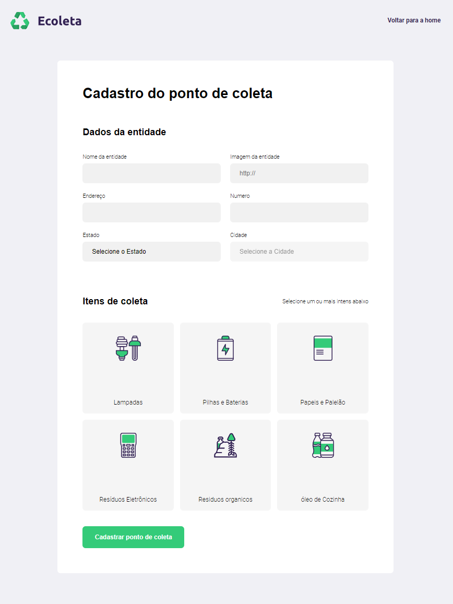

## Começando

Primeiro, execute o servidor de desenvolvimento:

```bash
npm install
# or
yarn install
```

Para executar o projeto:

```bash
npm run dev
# or
yarn dev
```

Abra (http: // localhost: 3000) com seu navegador para ver o resultado.

## Saber mais e Screen

O Projeto usa as tecnologias 

"express": "^4.17.1",
"nunjucks": "^3.2.2",
"sqlite3": "^5.0.0"





